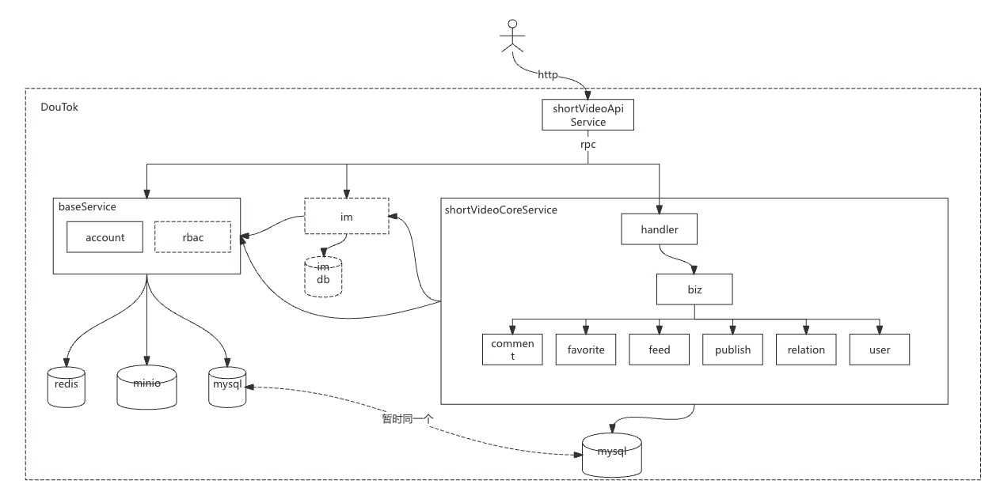
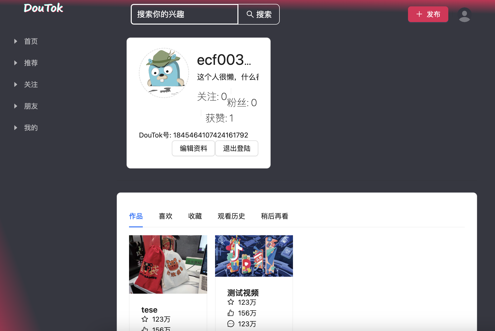
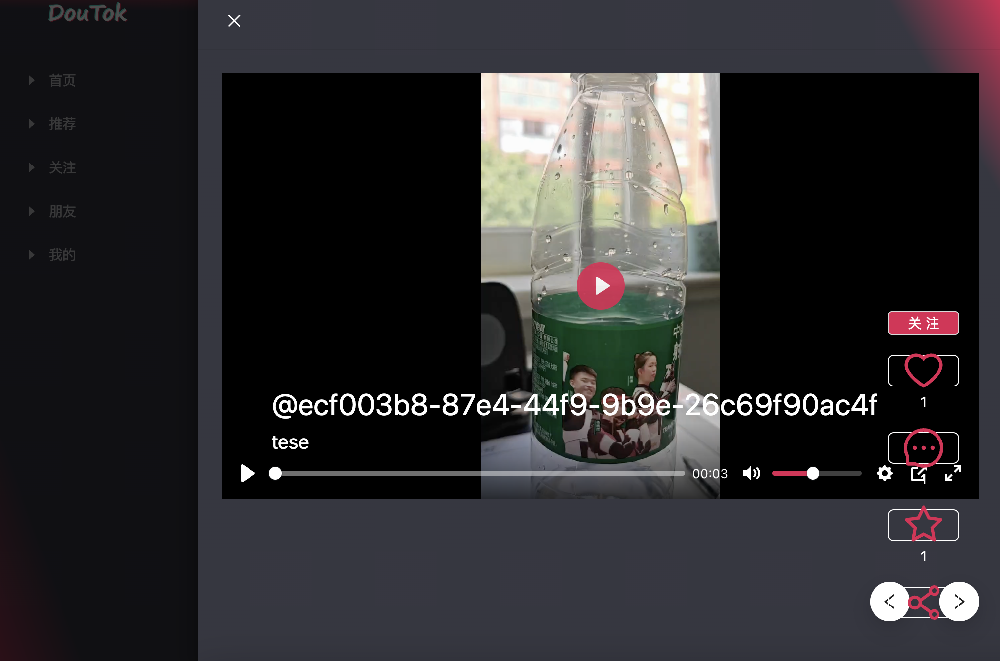
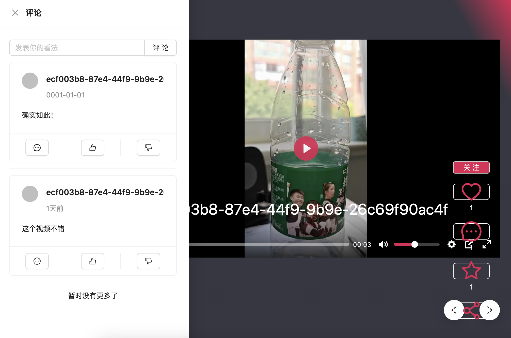

# DouTok
一个开源的 web 端的短视频应用，采用微服务架构（React & Go），DouTok 正处在开发初期，目前已经完成了基础的用户注册、登录、视频上传、视频列表展示、评论、点赞、收藏等功能。

当然，DouTok 还有很多功能没有实现，比如视频推荐、消息推送、私信等功能，这些功能将会在后续的开发中逐步实现。

无论你是**前端开发者**还是**后端开发者**，都可以参与到 DouTok 的开发中来，我们欢迎你的加入！

🔥 如何参与贡献：https://cloudzenith.github.io/DouTok/community

🐧 交流群2群: 446397231

📺 B站讲解：[白泽talk](https://space.bilibili.com/10399934)

🔑 开源学习仓库：[go-learning](https://github.com/BaiZe1998/go-learning)

## 快速开始
所有信息参考文档站（非常详细）：
<https://cloudzenith.github.io/DouTok/docs/quickstart/>

## 项目架构

## 主要目录
这是一个巨仓项目，所有的服务都在这个仓库中，目录结构如下：

- backend: 后端服务
- frontend: 前端服务
- test: 测试
- deploy: 部署
- docs-site: 文档站
- env: 依赖环境部署
- sql: 数据库脚本

## 页面展示
- 上传视频

- 浏览视频

- 评论 & 点赞 & 关注

