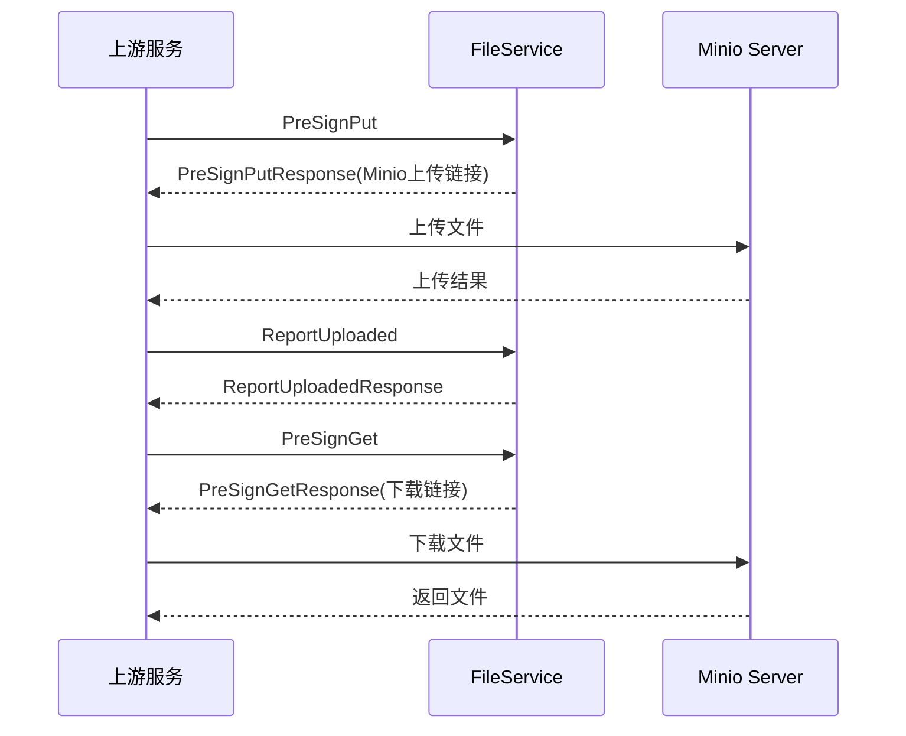
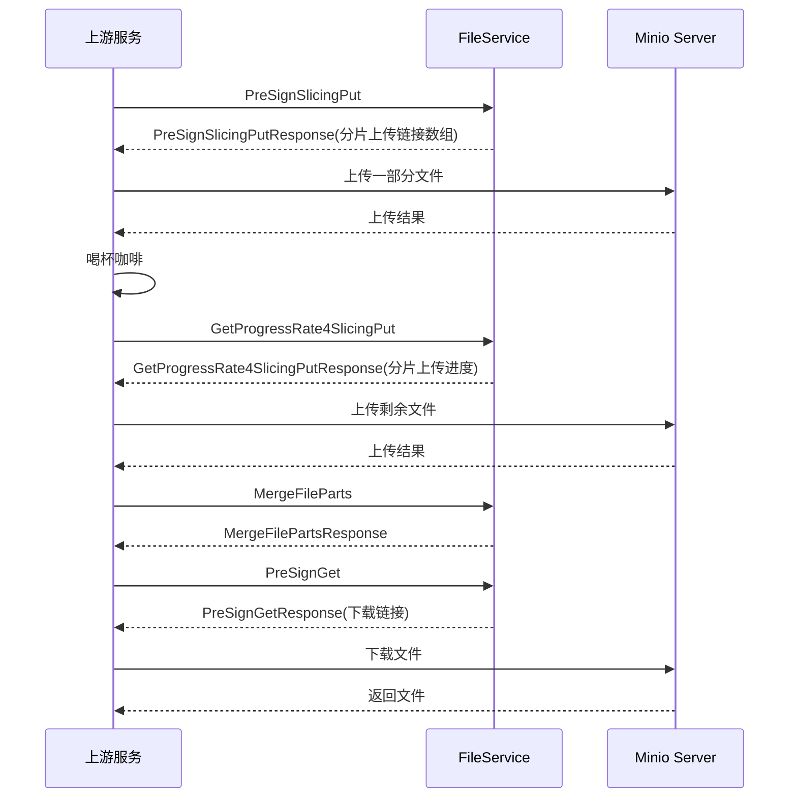

# FileService 主要能力

FileService用于向各个业务领域提供文件上传、下载的能力。在FileService的所有接口中，都存在一个名为`file context`的结构体，该参数通常用于指定文件相关的信息。其结构如下：

```protobuf
message FileContext {
  // 所属业务领域，用于创建bucket
  string domain = 1;
  // 所属业务名称
  string biz_name = 2;
  // 文件id
  int64 file_id = 3;
  // 文件sha256 hash
  string hash = 4;
  // 文件类型
  string file_type = 5;
  // 文件大小，单位byte
  int64 size = 6;
  // 文件访问链接的过期时间
  int64 expire_seconds = 7;
  // 文件名
  string filename = 8;
}
```

在各个请求中，`domain`和`biz_name`两个参数为必传项，这个2个参数组合后，将使得FileService所依赖的表以业务领域为维度进行第一次分表。在此基础上，可以为每个业务领域配置一个对应的二次分表，可以指定其分为若干张子表。

## Quick Start

FileService对于不同业务领域和不同业务项，其文件数量的扩增速度是不同的，带来的数据量很有可能天差地别。所以，要使用FileService的能力，需要在FileService中进行配置分表数量。

在`config.yaml`中，可以配置如下内容：

```yaml
data:
  db_sharding_config:
    file_shortvideo_short_video:
      sharding: file_shortvideo_short_video
      sharding_number: 5
```

`db_sharding_config`项用于配置分表数量，其下的`file_shortvideo_short_video`为分表key，其中"file"为固定值，`shortvideo`为业务领域，`short_video`为业务名称。`sharding_number`为分表数量。业务领域和业务名称需要在使用FileService时传入。如不进行配置，则默认分表数量为1。

## 主要链路

### 普通上传/下载



### 分片上传/断点续传



## 主要能力

### 普通上传

`FileService.PreSignPut`提供了最基础的上传能力。该接口需要额外上传的参数包括：

- hash: 文件的sha256值
- file_type: 文件类型
- size：文件大小（字节数）
- expire_seconds：文件上传链接的过期时间

例如，可以向此接口传入这样的参数:

```json
{
    "file_context": {
        "domain": "shortvideo",
        "biz_name": "short_video",
        "hash": "8D6BB0819A2C1E66F846031DC54AAF47",
        "file_type": "pdf",
        "size": 1181178,
        "expire_seconds": 86400
    }
}
```

访问后，该接口将返回一个上传链接（http），由上游服务/前端直接将文件上传到该链接。一个上传示例代码(Python)：

```python
with open(file_path, 'rb') as file_data:
    response = requests.put(
        minio_url, # 接口返回的上传链接
        data=file_data,
        headers={"Content-Type": "application/octet-stream"}
    )
    print(response)
    return response.status_code
```

通过上述Python代码的方式上传完成后，并不能直接访问到该文件，需要通过`FileService.ReportUploaded`接口来进行上传确认，只有上传确认后的文件，才会在数据库中被标记为`uploaded`并能被访问到。关于`FileService.ReportUploaded`的具体使用，将在下文中详细介绍。

### 分片上传

在一些情况下，需要上传的文件较大，如果直接上传，可能出现如下问题：

1. 上传较慢
2. 上传过程中如果出现问题，则需要重新上传整个文件

所以，FileService提供了分片上传的能力。

首先，可以通过`FileService.PreSignSlicingPut`预注册一个分片上传任务。该接口需要传入的参数与`FileService.PreSignPut`相同。接口返回的主要内容包括：

- urls：数组，各个分片的上传链接，且已经按照分片号排序
- upload_id：上传任务的id
- parts：分片总数
- file_id：文件id

参数示例:

```json
{
    "file_context": {
        "domain": "shortvideo",
        "biz_name": "short_video",
        "hash": "8D6BB0819A2C1E66F846031DC54AAF47",
        "file_type": "pdf",
        "size": 72246060,
        "expire_seconds": 86400
    }
}
```

此时，由上有服务/前端对文件进行分片(每一片大小为5MB)，然后将各个分片进行上传，一个文件分片的示例如下(Python):

```python
def slicing(filename):
    file_size = 5 * 1024 * 1024  # 10MB
    
    files = list()

    # 打开文件
    with open(filename, 'rb') as f:
        index = 0
        while True:
            # 定位到要读取的位置
            f.seek(index * file_size)
            # 读取数据
            data = f.read(file_size)
            # 如果已经读到文件末尾，退出循环
            if not data:
                break
            # 写入分割后的文件
            with open(f'{filename}_{index}', 'wb') as f1:
                f1.write(data)
            files.append(data)
            # 更新位置
            index += 1
    return files
```

全部分片上传完成后，可以通过`FileService.MergeFileParts`来合并分片。主要参数包括:

- file_id
- upload_id

参数示例:

```json
{
    "upload_id": "ZDNlOWI2MjktMjAzOC00NzJkLWE0ODYtOGMzZTBlZmJlODUwLmRmN2M5ZWQyLTYxMzMtNDM4NS1hNTljLWEwMzRlNTI5NWNkNHgxNzIzNzM5ODA2MTM2NzU3MzE5",
    "file_context": {
        "file_id": 1824123073628999680,
        "domain": "shortvideo",
        "biz_name": "short_video"
    }
    
}
```

与不同上传不同的是，分片上传在上传完成并调用`FileService.MergeFileParts`后，会自动进行上传确认，无需再次调用`FileService.ReportUploaded`。

### 断点续传

在上述分片上传的过程中，可以通过`FileService.GetProgressRate4SlicingPut`来获取分片上传的具体情况，主要传入的参数包括:

- file_id
- upload_id

该接口的返回值中包含一个名为`parts`的map，key为分片号，value为该分片是否上传完成，上游服务或服务端可以根据该信息来决定哪些分片需要重新上传

示例参数:

```json
{
    "upload_id": "ZDNlOWI2MjktMjAzOC00NzJkLWE0ODYtOGMzZTBlZmJlODUwLjA3ZTgyNmY0LWE4YjQtNDQxMC04M2QzLWY4ODQ4MTRiZGM4Y3gxNzIzNzM4ODUzMTMzMjY4ODQ3",
    "file_context": {
        "file_id": 1824119076553756672,
        "domain": "shortvideo",
        "biz_name": "short_video"
    }
    
}
```

返回值示例:

```json
{
    "parts": {
        "1": true,
        "2": true,
        "3": true,
        "4": true,
        "5": true,
        "6": true,
        "7": true,
        "8": true,
        "9": true,
        "10": true,
        "11": true,
        "12": true,
        "13": true,
        "14": true
    },
    "meta": {
        "reason": [],
        "biz_code": 0,
        "message": "success",
        "domain": ""
    },
    "progress_rate": 100
}
```

### 上传确认

在上传完成时（分片上传除外，分片上传结束时调用`FileService.MergeFileParts`会自动进行上传确认），都需要调用`FileService.ReportUploaded`来进行上报，该接口必传参数为:

- file_id

这一接口主要完成这样一件事：检查文件的hash，检查通过后将文件标记为“上传成功状态”，否则文件将不可被查询到。

参数示例：

```json
{
    "file_context": {
        "domain": "shortvideo",
        "biz_name": "short_video",
        "file_id": "1824118603822141440"
    }
}
```

### 下载文件

通过`FileService.PreSignGet`接口则可以获取下载文件链接，该接口主要传入的参数包括：

- file_id
- expire_seconds

参数示例:

```json
{
    "file_context": {
        "domain": "shortvideo",
        "biz_name": "short_video",
        "file_id": "1824123073628999680",
        "expire_seconds": 86400,
        "filename": "data.mp4"
    }
}
```

### 秒传

在`FileService.PreSignPut`和`FileService.PreSignSlicingPut`接口中，如果传入的hash已经存在，则会返回一个`file_id`，这个`file_id`可以用于获取下载链接，从而不需要再次上传文件。
