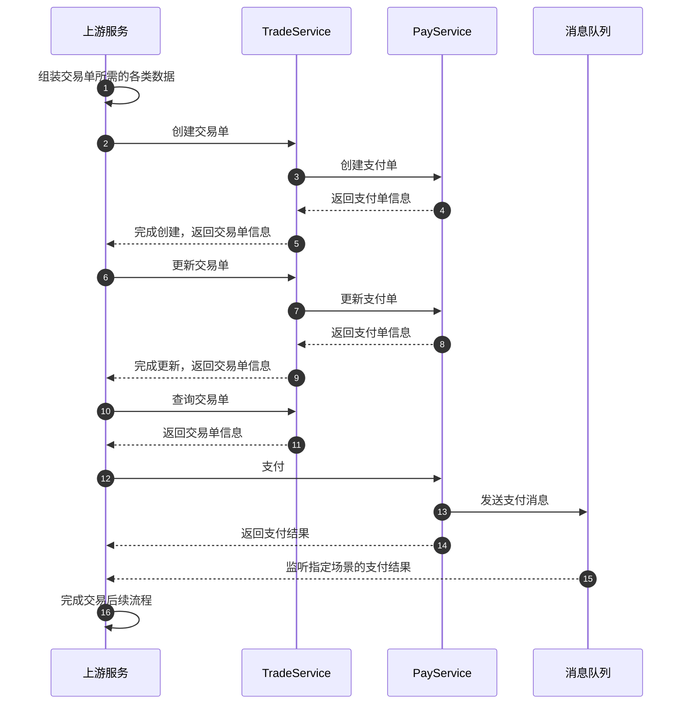

# 交易能力

```mermaid
sequenceDiagram
    autonumber

    participant up as 上游服务
    participant ts as TradeService
    participant pps as PayService
    participant mq as 消息队列

    up ->> up: 组装交易单所需的各类数据

    up ->> ts: 创建交易单
    ts ->> pps: 创建支付单
    pps -->> ts: 返回支付单信息
    ts -->> up: 完成创建，返回交易单信息

    up ->> ts: 更新交易单
    ts ->> pps: 更新支付单
    pps -->> ts: 返回支付单信息
    ts -->> up: 完成更新，返回交易单信息

    up ->> ts: 查询交易单
    ts -->> up: 返回交易单信息

    up ->> pps: 支付
    pps ->> mq: 发送支付消息
    pps -->> up: 返回支付结果

    mq -->> up: 监听指定场景的支付结果

    up ->> up: 完成交易后续流程
```
