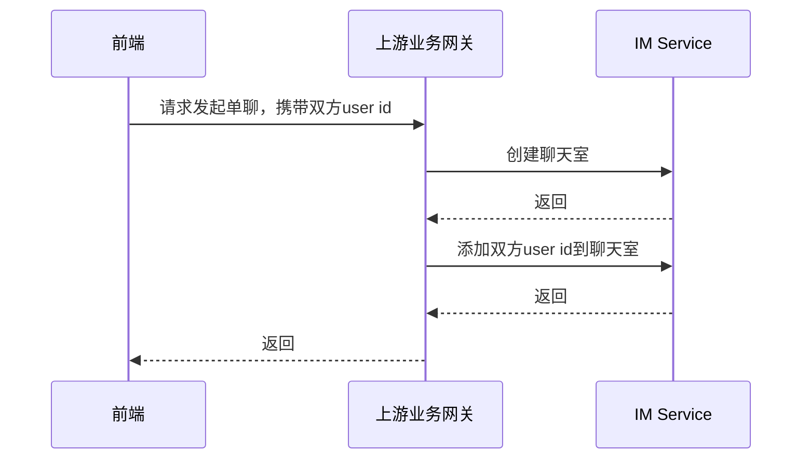
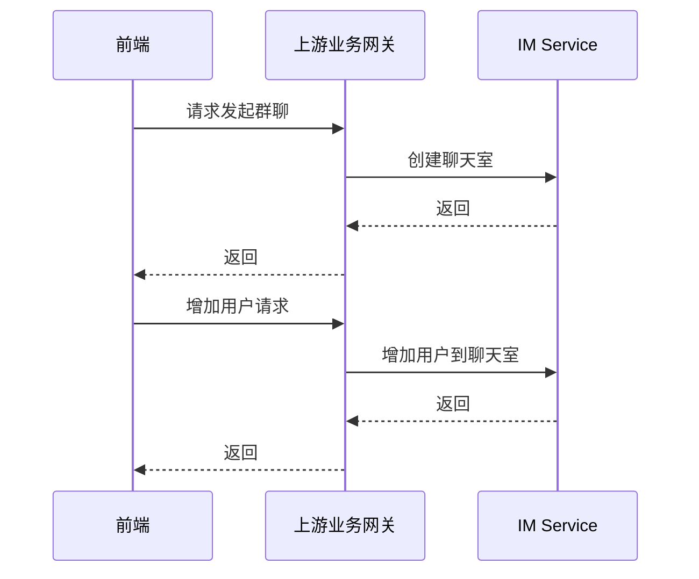
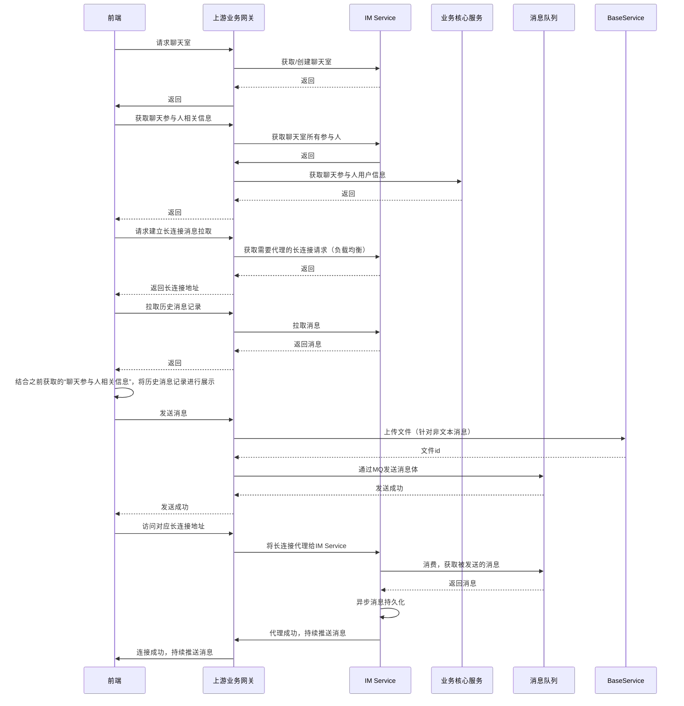

# IM Service 设计思路

IM Service 用于提供即时通讯服务，主要包括消息发送、消息接收、消息撤回、消息删除等功能。IM Service 通过消息队列进行消息的异步处理，通过消息队列的方式，可以保证消息的可靠性，同时也可以保证消息的顺序性。

## 基本概念

1. 用户：在一组即时通信中，参与通信的实体，对应BaseService中Account的概念
2. 聊天室：对应“一组即时通信”，一个聊天室可以有1~n个用户，具体有多少用户可以由上层服务自行定义
3. 消息：用户之间传递的消息，包括文本消息、图片消息、语音消息、视频消息等类型。文本消息下，消息内容为相应文本；其他情况下为对应的文件id

## 主要接口

### 聊天室服务

- 创建聊天室 Create
- 获取聊天室信息 Get
- 删除聊天室 Remove
- 加入聊天室 AddAccount2Room
- 离开聊天室 RmAccountFromRoom

### 聊天记录服务

- 推送聊天记录接口 Push
- 拉取聊天记录 Pull
- 获取长连接地址用于拉取聊天记录 PullByActiveConnection

### 特殊接口：通过长连接进行消息拉取

优点：

- 低延迟
- 降低连接的数量
- 可以随时增加或减少IM Service服务的数量

## 主要链路

### 发起单聊

### 发起群聊

### 开始聊天

