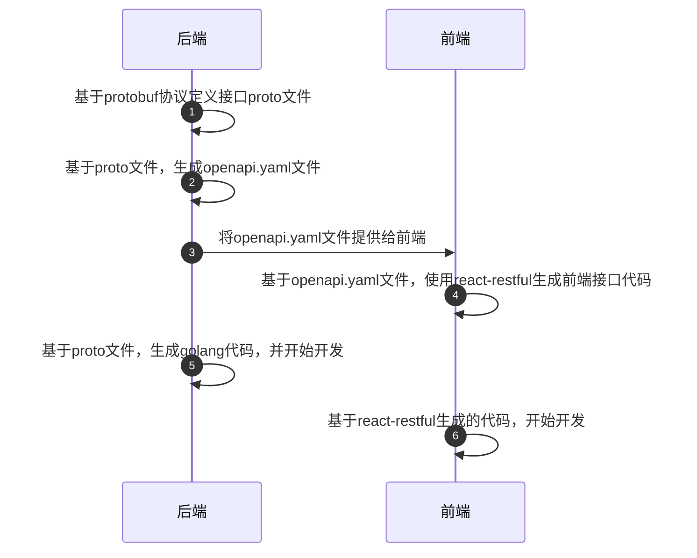

# tools

tools目录是一个工具目录，其下用于存放一些工具性质的代码包，如下是已有工具的简介：

## 魔改版proto生成插件

### 为什么要魔改

相关的原版官方插件存在一定的功能缺失，不能满足DouTok的开发需求，相关插件已经发展成熟，向这些插件提PR的周期较长，所以选择自行魔改。当然，魔改版插件尽量保持了原版插件的特性。

### 现状

目前，魔改版的proto生成插件有：

- protoc-gen-go-http
- protoc-gen-go-openapi

DouTok后端服务与前端服务是通过HTTP协议进行通信的。在这种模式下，通常需要前、后端各自定义一套接口文件，导致前后端开发效率有一定的下降（尤其是有大量接口更新时）。为了解决这个问题，DouTok使用如下模式处理前后端接口代码的交互：

这样做可以将前后端的接口代码串起来并标准化，尤其是前端不再需要去定义接口，`react-restful`生成的代码为钩子函数，在React组件使用也非常方便。

在定义后端接口的过程中，我们至少需要定义`code`和`message`这样的字段，来表示当前的业务状态码、相关信息。这样的字段是几乎所有接口都需要涉及到的，所有的接口都需要在proto文件中就显式的定义这2个字段，这样做毫无疑问是不够优雅的。

要解决这个问题，就需要有一个“拦截器”形式的组件来进行处理。但是，后端通过proto生成的golang代码中包含有对返回体类型的断言，所以难以对返回体进行统一处理。前端虽可实现拦截器，但是在打开代码lint的情况下，会让人觉得不太舒服（另外一个原因是，笔者并不精通前端开发，可能有更好的解决方案被错过了）。为了一了百了，笔者选择在proto生成代码的过程中进行处理。

所以，魔改版proto插件的主要修改点是：

1. 生成的golang代码中取消强断言返回体的流程，使之可以通过中间件处理返回数据，与接口函数返回的`error`进行联动
2. 生成的openapi.yaml代码自动增加`code`和`msg`字段，相应的，前端代码生成后也会包含这部分代码
